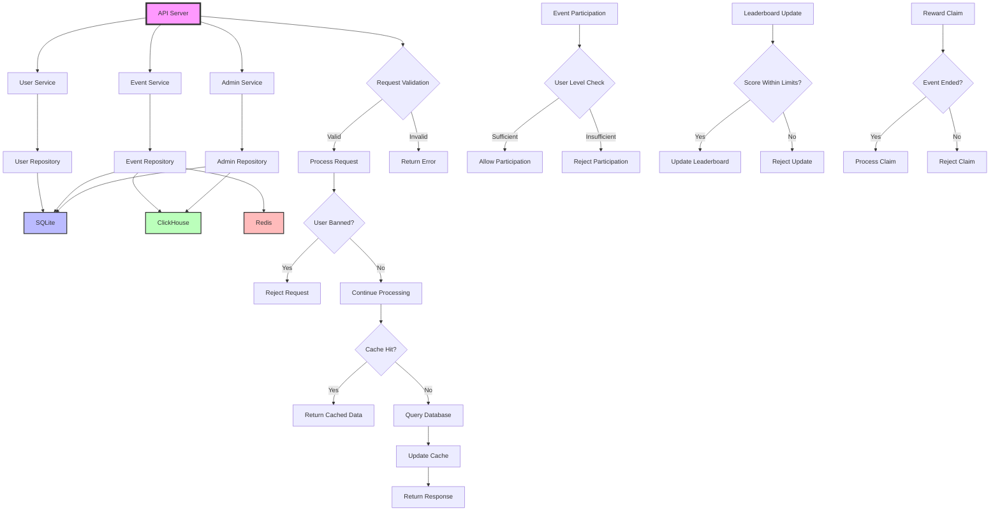

# Leaderboard API

This project implements a REST API using Golang for managing user profiles, events, and leaderboards. It supports both group and country-based leaderboards, with specific rules for user participation and rewards.

# Table of Contents

- [Leaderboard API](#leaderboard-api)
  - [Features](#features)
- [Architecture](#architecture)
- [Getting Started](#getting-started)
  - [Deployed API](#deployed-api)
  - [Prerequisites](#prerequisites)
  - [Running locally](#running-locally)
    - [Environment Setup](#environment-setup)
    - [Build and Run](#build-and-run)
      - [Using Docker](#using-docker)
      - [Without Docker](#without-docker)
    - [Testing](#testing)
- [Deployment](#deployment)
  - [Cloud Deployment (Example for AWS)](#cloud-deployment-example-for-aws)
- [API Documentation](#api-documentation)
  - [User Operations](#user-operations)
  - [Event Operations](#event-operations)
  - [Admin Operations](#admin-operations)
- [API Reference](#api-reference)
  - [Endpoints](#endpoints)
  - [Create User Profile](#create-user-profile)
  - [Set User Level](#set-user-level)
  - [Set User Coin](#set-user-coin)
  - [Create Event](#create-event)
  - [Join Event](#join-event)
  - [Update Leaderboard Progress](#update-leaderboard-progress)
  - [Get Leaderboard](#get-leaderboard)
  - [Get Country Leaderboard](#get-country-leaderboard)
  - [Claim Leaderboard Reward](#claim-leaderboard-reward)
- [Errors](#errors)
- [Load Testing](#load-testing)
  - [Example Test](#example-test)
  - [Test Results](#test-results)
  - [Running the load test with Go](#running-the-load-test-with-go)


## Features

- User profile management (create, update, set level, set coin)
- Event participation and management
- Real-time group and country-based leaderboards
- Leaderboard progress tracking
- Reward claiming system
- Admin operations for event and user management

# Architecture



# Getting Started

This section provides instructions on how to set up and run the Leaderboard API project locally, as well as how to deploy it.


# Deployed API

You can also use the deployed version of this project instead of spinning up from scratch.


The API is available on: http://api.leaderboard.yagizdegirmenci.com


# Development

## Running locally

### Build and Run

#### Using Docker

1. Run the local development stack with:

   ```bash
   docker compose -f docker-compose.dev.yml up --build
   ```
2. Stop the services


  ```bash
  docker compose -f docker-compose.dev.yml down
  ```


Now, the API is available on http://0.0.0.0:80 on your host machine.


# Without Docker

## Prerequisites

- [Go 1.22.6 or later](https://golang.org/dl/)
- [Docker](https://www.docker.com/get-started)
- [ClickHouse](https://clickhouse.com/docs/en/install)
- [Redis](https://redis.io/download)
- [SQLite](https://www.sqlite.org/download.html)

### Environment Setup

1. Clone the repository:
   ```bash
   git clone https://github.com/ycd/leaderboard.git
   cd leaderboard
   ```

2. Set up environment variables:
   Create a `.env` file in the project root and add the following variables:
   ```
   REDIS_HOST=localhost
   REDIS_PORT=6379
   REDIS_PASSWORD=your_redis_password
   CLICKHOUSE_HOST=localhost
   CLICKHOUSE_PORT=8123
   CLICKHOUSE_USER=default
   CLICKHOUSE_PASSWORD=password
   ```


1. Install dependencies:
   ```bash
   go mod download
   ```

2. Run the API:
   ```bash
   go run cmd/api/main.go
   ```

# Deployment

## Cloud Deployment (Example for AWS)

1. Set up an EC2 instance or ECS cluster
2. Deploy the API using Docker:
   ```bash
   docker compose up --build
   ```
3. The API will be available on http://<your-ec2-instance-public-ip>:80

## API Documentation

### User Operations

- `POST /user/profile`: Set or update user profile
- `POST /user/level`: Set user level
- `POST /user/coin`: Set user coin amount

### Event Operations

- `POST /event/join`: Join an event
- `POST /event/leaderboard/progress`: Update leaderboard progress
- `GET /event/leaderboard`: Get group leaderboard
- `GET /event/country-leaderboard`: Get country leaderboard
- `POST /event/leaderboard/claim`: Claim leaderboard reward

### Admin Operations

- `POST /admin/event`: Create a new event
- `GET /admin/events`: List all events
- `DELETE /admin/event`: Delete an event
- `GET /admin/user`: Get user details
- `GET /admin/users`: List all users
- `POST /admin/user/ban`: Ban a user
- `POST /admin/user/unban`: Unban a user
- `POST /admin/leaderboard/reset`: Reset a leaderboard

For detailed request/response formats, refer to the API specification document.


# API Reference

# Endpoints

```mermaid
graph TD
    A[API Server]
    A --> B[User Group]
    A --> C[Event Group]
    A --> D[Admin Group]

    B --> B1[POST /user/profile]
    B --> B2[POST /user/level]
    B --> B3[POST /user/coin]

    C --> C1[POST /event/join]
    C --> C2[POST /event/leaderboard/progress]
    C --> C3[GET /event/leaderboard]
    C --> C4[GET /event/country-leaderboard]
    C --> C5[POST /event/leaderboard/claim]

    D --> D1[POST /admin/event]
    D --> D2[GET /admin/events]
    D --> D3[DELETE /admin/event]
    D --> D4[GET /admin/user]
    D --> D5[GET /admin/users]
    D --> D6[POST /admin/user/ban]
    D --> D7[POST /admin/user/unban]
    D --> D8[POST /admin/leaderboard/reset]

    style A fill:#f9f,stroke:#333,stroke-width:4px
    style B fill:#bbf,stroke:#333,stroke-width:2px
    style C fill:#bfb,stroke:#333,stroke-width:2px
    style D fill:#fbb,stroke:#333,stroke-width:2px
```




---

### Create User Profile

```http
POST /user/profile
```

| Parameter | Type   | Description                       |
| :-------- | :----- | :-------------------------------- |
| `username`| string | **Required**. The user's username |
| `country` | string | **Required**. The user's country (e.g., US) |

#### Request
```
curl --location 'http://api.leaderboard.yagizdegirmenci.com/user/profile' \
--header 'Content-Type: application/json' \
--data '{
    "username": "testuser-41414141414141414141414141",
    "country": "US"
}'
```

#### Response

```json
{
  "id": "64f6faea-db27-415f-a7bc-6b8cd8e893d1",
  "username": "testuser-1623456789012",
  "country": "US",
  "level": 85,
  "coin": 100
}
```

---

### Set User Level

```http
POST /user/level
```

| Parameter | Type   | Description                        |
| :-------- | :----- | :--------------------------------- |
| `user_id` | string | **Required**. The user's ID (UUID) |
| `level`   | int    | **Required**. The level to set (81-100) |

#### Request
```
curl --location 'http://api.leaderboard.yagizdegirmenci.com/user/level' \
--header 'Content-Type: application/json' \
--data '{
    "user_id": "5d8d253c-b033-483b-b7d1-a00d0bfaee7f",
    "level": 94
}'
```

#### Response

```json
{
    "user_id": "5d8d253c-b033-483b-b7d1-a00d0bfaee7f",
    "level": 94
}
```

---

### Set User Coin

```http
POST /user/coin
```

| Parameter | Type   | Description                        |
| :-------- | :----- | :--------------------------------- |
| `user_id` | string | **Required**. The user's ID (UUID) |
| `coin`    | int    | **Required**. The amount of coins to set |

#### Request
```
curl --location 'http://api.leaderboard.yagizdegirmenci.com/user/coin' \
--header 'Content-Type: application/json' \
--data '{
    "user_id": "64f6faea-db27-415f-a7bc-6b8cd8e893d1",
    "coin": 100
}'
```


#### Response

```json
{
  "user_id": "64f6faea-db27-415f-a7bc-6b8cd8e893d1",
  "coin": 100
}
```

---

### Create Event

```http
POST /admin/event
```

| Parameter  | Type   | Description                              |
| :--------- | :----- | :--------------------------------------- |
| `name`     | string | **Required**. The event's name           |
| `start_time`| string| **Required**. Start time in ISO 8601 format |
| `end_time` | string | **Required**. End time in ISO 8601 format  |

#### Request
```
curl --location 'http://api.leaderboard.yagizdegirmenci.com/admin/event' \
--header 'Content-Type: application/json' \
--data '{
    "name": "masters",
    "start_time": "2023-09-01T00:00:00Z",
    "end_time": "2023-09-30T23:59:59Z"
}'
```

#### Response

```json
{
  "id": "c11ebca8-3c95-4d2c-a6f4-01e9b5e356c5",
  "name": "masters",
  "start_time": "2023-07-29T12:34:56Z",
  "end_time": "2023-08-28T12:34:56Z"
}
```

---

### Join Event

```http
POST /event/join
```

| Parameter | Type   | Description                        |
| :-------- | :----- | :--------------------------------- |
| `event_id`| string | **Required**. The event's ID (UUID) |
| `user_id` | string | **Required**. The user's ID (UUID) |

#### Request
```
curl --location 'http://api.leaderboard.yagizdegirmenci.com/event/join' \
--header 'Content-Type: application/json' \
--data '{
    "event_id": "c11ebca8-3c95-4d2c-a6f4-01e9b5e356c5",
    "user_id": "e18e9b24-f251-402f-b3fd-e6404431d3d2"
}'
```

#### Response

```json
{
  "user_id": "64f6faea-db27-415f-a7bc-6b8cd8e893d1",
  "event_id": "event-12345",
  "success": true
}
```

---

### Update Leaderboard Progress

```http
POST /event/leaderboard/progress
```

| Parameter | Type   | Description                                |
| :-------- | :----- | :----------------------------------------- |
| `event_id`| string | **Required**. The event's ID (UUID)         |
| `user_id` | string | **Required**. The user's ID (UUID)         |
| `score`   | int    | **Required**. The score to update (1-10000) |

#### Request

```
curl --location 'http://api.leaderboard.yagizdegirmenci.com/event/leaderboard/progress' \
--header 'Content-Type: application/json' \
--data '{
    "event_id": "c11ebca8-3c95-4d2c-a6f4-01e9b5e356c5",
    "user_id": "eae8f8ec-d118-45aa-b6c6-02997d071b1d",
    "score": 42
}'
```


#### Response

```json
{
  "user_id": "64f6faea-db27-415f-a7bc-6b8cd8e893d1",
  "event_id": "event-12345",
  "score": 5000,
  "success": true
}
```

---

### Get Leaderboard

```http
GET /leaderboard
```

| Parameter | Type   | Description                        |
| :-------- | :----- | :--------------------------------- |
| `event_id`| string | **Required**. The event's ID (UUID) |
| `limit`   | int    | **Required**. The number of leaderboard entries to retrieve |

#### Request
```
curl --location 'http://api.leaderboard.yagizdegirmenci.com/event/leaderboard?event_id=c11ebca8-3c95-4d2c-a6f4-01e9b5e356c5&limit=100'
```

#### Response

```json
{
    "event_id": "c11ebca8-3c95-4d2c-a6f4-01e9b5e356c5",
    "entries": [
        {
            "user_id": "eae3edd8-d901-4f97-aea2-e8aa4751b67c",
            "total_score": 982,
            "rank": 1
        },
        {
            "user_id": "5168b3e2-b13b-4e9c-9f7e-d96e623ff32f",
            "total_score": 975,
            "rank": 2
        },
        {
            "user_id": "25f19803-0093-40b8-a0db-e36e0d92df76",
            "total_score": 874,
            "rank": 3
        },
        {
            "user_id": "eae8f8ec-d118-45aa-b6c6-02997d071b1d",
            "total_score": 835,
            "rank": 4
        },
    ]
}
```

---

### Get Country Leaderboard

```http
GET /event/country-leaderboard
```

| Parameter | Type   | Description                                |
| :-------- | :----- | :----------------------------------------- |
| `event_id`| string | **Required**. The event's ID (UUID)         |
| `country` | string | **Required**. The country code (e.g., US)    |
| `limit`   | int    | **Required**. The number of leaderboard entries to retrieve |

#### Request

```
curl --location 'http://api.leaderboard.yagizdegirmenci.com/event/country-leaderboard?event_id=c11ebca8-3c95-4d2c-a6f4-01e9b5e356c5&limit=100&country=US'
```

#### Response

```json
{
    "event_id": "c11ebca8-3c95-4d2c-a6f4-01e9b5e356c5",
    "entries": [
        {
            "user_id": "eae3edd8-d901-4f97-aea2-e8aa4751b67c",
            "country": "US",
            "total_score": 982,
            "rank": 1
        },
        {
            "user_id": "5168b3e2-b13b-4e9c-9f7e-d96e623ff32f",
            "country": "US",
            "total_score": 975,
            "rank": 2
        },
        {
            "user_id": "25f19803-0093-40b8-a0db-e36e0d92df76",
            "country": "US",
            "total_score": 874,
            "rank": 3
        },
        {
            "user_id": "eae8f8ec-d118-45aa-b6c6-02997d071b1d",
            "country": "US",
            "total_score": 835,
            "rank": 4
        },
    ]
}
```

---

### Claim Leaderboard Reward

```http
POST /claim/reward
```

| Parameter | Type   | Description                        |
| :-------- | :----- | :--------------------------------- |
| `user_id` | string | **Required**. The user's ID (UUID) |
| `event_id`| string | **Required**. The event's ID (UUID) |

#### Request
```
curl --location 'http://api.leaderboard.yagizdegirmenci.com/claim/reward' \
--header 'Content-Type: application/json' \
--data '{
    "user_id": "eae3edd8-d901-4f97-aea2-e8aa4751b67c",
    "event_id": "c11ebca8-3c95-4d2c-a6f4-01e9b5e356c5"
}'
```

#### Response

```json
{
  "user_id": "64f6faea-db27-415f-a7bc-6b8cd8e893d1",
  "event_id": "event-12345",
  "rank": 1,
  "reward_coin": 500,
  "success": true
}
```


### Errors

The API may return the following error responses:

| HTTP Status Code | Error Type | Description |
| :--------------- | :--------- | :---------- |
| 400 | ErrInvalidRequest | The request body or parameters are invalid |
| 400 | ErrInvalidUsername | The provided username is invalid |
| 400 | ErrInvalidCountry | The provided country code is invalid |
| 400 | ErrInvalidLevel | The provided level is invalid (must be between 81-100) |
| 400 | ErrInvalidCoin | The provided coin amount is invalid |
| 400 | ErrInvalidScore | The provided score is invalid (must be between 1-10000) |
| 400 | ErrInvalidEventDates | The provided event start or end dates are invalid |
| 401 | ErrUnauthorized | The request lacks valid authentication credentials |
| 403 | ErrUserBanned | The user is banned and cannot perform this action |
| 403 | ErrInsufficientLevel | The user's level is too low to join the event |
| 404 | ErrUserNotFound | The specified user was not found |
| 404 | ErrEventNotFound | The specified event was not found |
| 404 | ErrLeaderboardNotFound | The leaderboard for the specified event was not found |
| 404 | ErrCountryLeaderboardNotFound | The country leaderboard for the specified event was not found |
| 409 | ErrUserAlreadyExists | A user with the provided username already exists |
| 409 | ErrUserAlreadyJoined | The user has already joined this event |
| 409 | ErrEventEnded | The event has already ended |
| 409 | ErrEventNotStarted | The event has not started yet |
| 409 | ErrRewardAlreadyClaimed | The user has already claimed the reward for this event |
| 403 | ErrNotEligibleForReward | The user is not eligible for a reward in this event |
| 500 | ErrInternalServerError | An unexpected error occurred on the server |
| 500 | ErrDatabaseError | An error occurred while interacting with the database |

## Error Response Format

```json
{
  "error": "error_type",
  "message": "error_message"
}
```


## Load Testing


You can use a robust tool like [hey](https://github.com/rakyll/hey) to load test the API.


An example tests with 1000 request with 200 concurrency.

### Example Test
```
hey -n 1000 -c 200 http://api.leaderboard.yagizdegirmenci.com/event/leaderboard\?event_id\=f8b14ae0-b8ce-406e-bb9e-d26c098db60b\&limit\=10
```


### Test Results
```bash
Summary:
  Total:        3.0682 secs
  Slowest:      1.8521 secs
  Fastest:      0.0478 secs
  Average:      0.4830 secs
  Requests/sec: 325.9264


Response time histogram:
  0.048 [1]     |
  0.228 [351]   |■■■■■■■■■■■■■■■■■■■■■■■■■■■■■■■■■■■■■■■■
  0.409 [154]   |■■■■■■■■■■■■■■■■■■
  0.589 [172]   |■■■■■■■■■■■■■■■■■■■■
  0.770 [117]   |■■■■■■■■■■■■■
  0.950 [76]    |■■■■■■■■■
  1.130 [59]    |■■■■■■■
  1.311 [12]    |■
  1.491 [22]    |■■■
  1.672 [16]    |■■
  1.852 [20]    |■■


Latency distribution:
  10% in 0.0716 secs
  25% in 0.1326 secs
  50% in 0.3927 secs
  75% in 0.6861 secs
  90% in 1.0264 secs
  95% in 1.3328 secs
  99% in 1.7978 secs

Details (average, fastest, slowest):
  DNS+dialup:   0.0111 secs, 0.0478 secs, 1.8521 secs
  DNS-lookup:   0.0057 secs, 0.0000 secs, 0.0617 secs
  req write:    0.0003 secs, 0.0000 secs, 0.0093 secs
  resp wait:    0.4715 secs, 0.0474 secs, 1.7893 secs
  resp read:    0.0002 secs, 0.0000 secs, 0.0109 secs

Status code distribution:
  [200] 1000 responses
```

### Run the Load test with a Request Body


### Running the load test with Go


There is also a test function in 'tests/load_test.go' file.

You can run it with:

```go
 go test -timeout 60s -run ^TestLoad$ github.com/ycd/leaderboard/tests -v -count=1
 ```

Note: Increase the timeout depending on your internet speed, it may take longer on slower network conditions.


### Create Mock Data

You can create mock data with the following command:

```go
go run cmd/mock_data/main.go
```


It is some sort of a stress test, and you can start exploring the API right away the the job is finished.

```bash
2024/09/15 15:15:02 Created 70 users in 418.801017ms
2024/09/15 15:15:02 Updated level for 70 users in 253.072564ms
2024/09/15 15:15:02 Created event: {{c11ebca8-3c95-4d2c-a6f4-01e9b5e356c5 masters 2024-09-01 00:00:00 +0000 UTC 2024-09-30 23:59:59 +0000 UTC}} in 72.775924ms
2024/09/15 15:15:02 Event ID: c11ebca8-3c95-4d2c-a6f4-01e9b5e356c5
2024/09/15 15:15:07 Joined event for 70 users in 4.545786364s
2024/09/15 15:15:35 Updated leaderboard with 700 progress events in 28.394943852s
2024/09/15 15:15:36 Retrieved leaderboard in 262.957344ms
2024/09/15 15:15:36 Load test completed
2024/09/15 15:15:36 Total users created: 70
2024/09/15 15:15:36 Total events created: 1
2024/09/15 15:15:36 Total leaderboard updates: 1050
```


## Send a request

```bash
curl --location 'http://api.leaderboard.yagizdegirmenci.com/event/leaderboard?event_id=c11ebca8-3c95-4d2c-a6f4-01e9b5e356c5&limit=100'
```


## Explore the data

```json
{
    "event_id": "c11ebca8-3c95-4d2c-a6f4-01e9b5e356c5",
    "entries": [
        {
            "user_id": "eae3edd8-d901-4f97-aea2-e8aa4751b67c",
            "total_score": 982,
            "rank": 1
        },
        {
            "user_id": "5168b3e2-b13b-4e9c-9f7e-d96e623ff32f",
            "total_score": 975,
            "rank": 2
        },
        {
            "user_id": "25f19803-0093-40b8-a0db-e36e0d92df76",
            "total_score": 874,
            "rank": 3
        },
        {
            "user_id": "eae8f8ec-d118-45aa-b6c6-02997d071b1d",
            "total_score": 835,
            "rank": 4
        },
    ]
}
```
