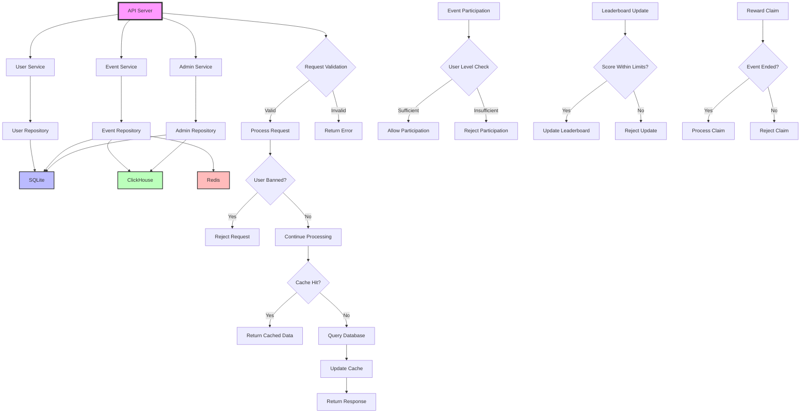

# Leaderboard API

This project implements a REST API using Golang for managing user profiles, events, and leaderboards. It supports both group and country-based leaderboards, with specific rules for user participation and rewards.

# Table of Contents

- [Leaderboard API](#leaderboard-api)
  - [Features](#features)
- [Architecture](#architecture)
- [Getting Started](#getting-started)
  - [Deployed API](#deployed-api)
  - [Prerequisites](#prerequisites)
  - [Running locally](#running-locally)
    - [Environment Setup](#environment-setup)
    - [Build and Run](#build-and-run)
      - [Using Docker](#using-docker)
      - [Without Docker](#without-docker)
    - [Testing](#testing)
- [Deployment](#deployment)
  - [Cloud Deployment (Example for AWS)](#cloud-deployment-example-for-aws)
  - [Scaling Considerations](#scaling-considerations)
- [API Documentation](#api-documentation)
  - [User Operations](#user-operations)
  - [Event Operations](#event-operations)
  - [Admin Operations](#admin-operations)
- [API Reference](#api-reference)
  - [Endpoints](#endpoints)
  - [Create User Profile](#create-user-profile)
  - [Set User Level](#set-user-level)
  - [Set User Coin](#set-user-coin)
  - [Create Event](#create-event)
  - [Join Event](#join-event)
  - [Update Leaderboard Progress](#update-leaderboard-progress)
  - [Get Leaderboard](#get-leaderboard)
  - [Get Country Leaderboard](#get-country-leaderboard)
  - [Claim Leaderboard Reward](#claim-leaderboard-reward)
- [Errors](#errors)
- [Load Testing](#load-testing)
  - [Example Test](#example-test)
  - [Test Results](#test-results)
  - [Running the load test with Go](#running-the-load-test-with-go)


## Features

- User profile management (create, update, set level, set coin)
- Event participation and management
- Real-time group and country-based leaderboards
- Leaderboard progress tracking
- Reward claiming system
- Admin operations for event and user management

# Architecture



# Getting Started

This section provides instructions on how to set up and run the Leaderboard API project locally, as well as how to deploy it.


# Deployed API

You can also use the deployed version of this project instead of spinning up from scratch.


The API is available on: http://leaderboard.yagizdegirmenci.com:8080


# Development

## Running locally

## Prerequisites

- [Go 1.22.6 or later](https://golang.org/dl/)
- [Docker](https://www.docker.com/get-started)
- [ClickHouse](https://clickhouse.com/docs/en/install)
- [Redis](https://redis.io/download)
- [SQLite](https://www.sqlite.org/download.html)

### Environment Setup

1. Clone the repository:
   ```bash
   git clone https://github.com/ycd/leaderboard.git
   cd leaderboard
   ```

2. Set up environment variables:
   Create a `.env` file in the project root and add the following variables:
   ```
   REDIS_HOST=localhost
   REDIS_PORT=6379
   REDIS_PASSWORD=your_redis_password
   CLICKHOUSE_HOST=localhost
   CLICKHOUSE_PORT=8123
   CLICKHOUSE_USER=default
   CLICKHOUSE_PASSWORD=password
   ```

3. Install dependencies:
   ```bash
   go mod download
   ```

### Build and Run

#### Using Docker

1. Build the Docker image:
   ```bash
   docker build -t leaderboard-api .
   ```

2. Run the containers:
   ```bash
   docker-compose up -d
   ```

#### Without Docker

1. Install dependencies:
   ```bash
   go mod download
   ```

2. Run the API:
   ```bash
   go run cmd/api/main.go
   ```

### Testing

1. Run unit tests:
   ```bash
   go test ./...
   ```

# Deployment

## Cloud Deployment (Example for AWS)

1. Set up an EC2 instance or ECS cluster
2. Set up a Redis instance (ElastiCache)
3. Set up a ClickHouse instance (self-hosted or managed service)
4. Deploy the API using Docker:
   ```bash
   docker run -d -p 8080:8080 \
     -e PORT=8080 \
     -e REDIS_HOST=your_redis_host \
     -e REDIS_PORT=your_redis_port \
     -e REDIS_PASSWORD=your_redis_password \
     -e CLICKHOUSE_HOST=your_clickhouse_host \
     -e CLICKHOUSE_PORT=your_clickhouse_port \
     -e CLICKHOUSE_USER=your_clickhouse_user \
     -e CLICKHOUSE_PASSWORD=your_clickhouse_password \
     leaderboard-api
   ```

## Scaling Considerations

- Use a load balancer to distribute traffic across multiple API instances
- Implement caching strategies using Redis for frequently accessed data
- Optimize ClickHouse queries and indexing for large-scale leaderboard operations
- Consider using a message queue (e.g., RabbitMQ, Kafka) for asynchronous processing of leaderboard updates

For more detailed information on the API endpoints and usage, refer to the API Reference section below.

## API Documentation

### User Operations

- `POST /user/profile`: Set or update user profile
- `POST /user/level`: Set user level
- `POST /user/coin`: Set user coin amount

### Event Operations

- `POST /event/join`: Join an event
- `POST /event/leaderboard/progress`: Update leaderboard progress
- `GET /event/leaderboard`: Get group leaderboard
- `GET /event/country-leaderboard`: Get country leaderboard
- `POST /event/leaderboard/claim`: Claim leaderboard reward

### Admin Operations

- `POST /admin/event`: Create a new event
- `GET /admin/events`: List all events
- `DELETE /admin/event`: Delete an event
- `GET /admin/user`: Get user details
- `GET /admin/users`: List all users
- `POST /admin/user/ban`: Ban a user
- `POST /admin/user/unban`: Unban a user
- `POST /admin/leaderboard/reset`: Reset a leaderboard

For detailed request/response formats, refer to the API specification document.


# API Reference

# Endpoints

```mermaid
graph TD
    A[API Server]
    A --> B[User Group]
    A --> C[Event Group]
    A --> D[Admin Group]

    B --> B1[POST /user/profile]
    B --> B2[POST /user/level]
    B --> B3[POST /user/coin]

    C --> C1[POST /event/join]
    C --> C2[POST /event/leaderboard/progress]
    C --> C3[GET /event/leaderboard]
    C --> C4[GET /event/country-leaderboard]
    C --> C5[POST /event/leaderboard/claim]

    D --> D1[POST /admin/event]
    D --> D2[GET /admin/events]
    D --> D3[DELETE /admin/event]
    D --> D4[GET /admin/user]
    D --> D5[GET /admin/users]
    D --> D6[POST /admin/user/ban]
    D --> D7[POST /admin/user/unban]
    D --> D8[POST /admin/leaderboard/reset]

    style A fill:#f9f,stroke:#333,stroke-width:4px
    style B fill:#bbf,stroke:#333,stroke-width:2px
    style C fill:#bfb,stroke:#333,stroke-width:2px
    style D fill:#fbb,stroke:#333,stroke-width:2px
```




---

### Create User Profile

```http
POST /user/profile
```

| Parameter | Type   | Description                       |
| :-------- | :----- | :-------------------------------- |
| `username`| string | **Required**. The user's username |
| `country` | string | **Required**. The user's country (e.g., US) |

#### Response

```json
{
  "id": "64f6faea-db27-415f-a7bc-6b8cd8e893d1",
  "username": "testuser-1623456789012",
  "country": "US",
  "level": 85,
  "coin": 100
}
```

---

### Set User Level

```http
POST /user/level
```

| Parameter | Type   | Description                        |
| :-------- | :----- | :--------------------------------- |
| `user_id` | string | **Required**. The user's ID (UUID) |
| `level`   | int    | **Required**. The level to set (81-100) |

#### Response

```json
{
    "user_id": "5d8d253c-b033-483b-b7d1-a00d0bfaee7f",
    "level": 94
}
```

---

### Set User Coin

```http
POST /user/coin
```

| Parameter | Type   | Description                        |
| :-------- | :----- | :--------------------------------- |
| `user_id` | string | **Required**. The user's ID (UUID) |
| `coin`    | int    | **Required**. The amount of coins to set |

#### Response

```json
{
  "user_id": "64f6faea-db27-415f-a7bc-6b8cd8e893d1",
  "coin": 100
}
```

---

### Create Event

```http
POST /admin/event
```

| Parameter  | Type   | Description                              |
| :--------- | :----- | :--------------------------------------- |
| `name`     | string | **Required**. The event's name           |
| `start_time`| string| **Required**. Start time in ISO 8601 format |
| `end_time` | string | **Required**. End time in ISO 8601 format  |

#### Request
```
curl --location 'http://leaderboard.yagizdegirmenci.com:8080/admin/event' \
--header 'Content-Type: application/json' \
--data '{
    "name": "alekhine",
    "start_time": "2023-09-01T00:00:00Z",
    "end_time": "2023-09-30T23:59:59Z"
}'
```

#### Response

```json
{
  "id": "event-12345",
  "name": "Event-1623456789",
  "start_time": "2023-07-29T12:34:56Z",
  "end_time": "2023-08-28T12:34:56Z"
}
```

---

### Join Event

```http
POST /event/join
```

| Parameter | Type   | Description                        |
| :-------- | :----- | :--------------------------------- |
| `event_id`| string | **Required**. The event's ID (UUID) |
| `user_id` | string | **Required**. The user's ID (UUID) |

#### Request
```
curl --location 'http://leaderboard.yagizdegirmenci.com:8080/event/join' \
--header 'Content-Type: application/json' \
--data '{
    "event_id": "event-12345",
    "user_id": "64f6faea-db27-415f-a7bc-6b8cd8e893d1"
}'
```

#### Response

```json
{
  "user_id": "64f6faea-db27-415f-a7bc-6b8cd8e893d1",
  "event_id": "event-12345",
  "success": true
}
```

---

### Update Leaderboard Progress

```http
POST /event/leaderboard/progress
```

| Parameter | Type   | Description                                |
| :-------- | :----- | :----------------------------------------- |
| `event_id`| string | **Required**. The event's ID (UUID)         |
| `user_id` | string | **Required**. The user's ID (UUID)         |
| `score`   | int    | **Required**. The score to update (1-10000) |

#### Request

```
curl --location 'http://leaderboard.yagizdegirmenci.com:8080/event/leaderboard/progress' \
--header 'Content-Type: application/json' \
--data '{
    "event_id": "5af98d12-2fcd-47ed-90bc-e13b3cdf6315",
    "user_id": "3fe23fbb-22ae-4543-9919-f32e4ac2afe9",
    "score": 1000
}'
```


#### Response

```json
{
  "user_id": "64f6faea-db27-415f-a7bc-6b8cd8e893d1",
  "event_id": "event-12345",
  "score": 5000,
  "success": true
}
```

---

### Get Leaderboard

```http
GET /leaderboard
```

| Parameter | Type   | Description                        |
| :-------- | :----- | :--------------------------------- |
| `event_id`| string | **Required**. The event's ID (UUID) |
| `limit`   | int    | **Required**. The number of leaderboard entries to retrieve |

#### Request
```
curl --location 'http://leaderboard.yagizdegirmenci.com:8080/leaderboard?event_id=event-12345&limit=10'
```

#### Response

```json
{
  "event_id": "event-12345",
  "entries": [
    {
      "user_id": "64f6faea-db27-415f-a7bc-6b8cd8e893d1",
      "username": "user1",
      "score": 9500,
      "rank": 1
    },
    {
      "user_id": "64f6faea-db27-415f-a7bc-6b8cd8e893d2",
      "username": "user2",
      "score": 9000,
      "rank": 2
    }
  ]
}
```

---

### Get Country Leaderboard

```http
GET /country/leaderboard
```

| Parameter | Type   | Description                                |
| :-------- | :----- | :----------------------------------------- |
| `event_id`| string | **Required**. The event's ID (UUID)         |
| `country` | string | **Required**. The country code (e.g., US)    |
| `limit`   | int    | **Required**. The number of leaderboard entries to retrieve |

#### Request

```
curl --location 'http://leaderboard.yagizdegirmenci.com:8080/country/leaderboard?event_id=event-12345&country=US&limit=10'
```

#### Response

```json
{
  "event_id": "event-12345",
  "country": "US",
  "entries": [
    {
      "user_id": "64f6faea-db27-415f-a7bc-6b8cd8e893d1",
      "username": "user1",
      "score": 9500,
      "rank": 1
    },
    {
      "user_id": "64f6faea-db27-415f-a7bc-6b8cd8e893d3",
      "username": "user3",
      "score": 9000,
      "rank": 2
    }
  ]
}
```

---

### Claim Leaderboard Reward

```http
POST /claim/reward
```

| Parameter | Type   | Description                        |
| :-------- | :----- | :--------------------------------- |
| `user_id` | string | **Required**. The user's ID (UUID) |
| `event_id`| string | **Required**. The event's ID (UUID) |

#### Request
```
curl --location 'http://leaderboard.yagizdegirmenci.com:8080/claim/reward' \
--header 'Content-Type: application/json' \
--data '{
    "user_id": "64f6faea-db27-415f-a7bc-6b8cd8e893d1",
    "event_id": "event-12345"
}'
```

#### Response

```json
{
  "user_id": "64f6faea-db27-415f-a7bc-6b8cd8e893d1",
  "event_id": "event-12345",
  "rank": 1,
  "reward_coin": 500,
  "success": true
}
```


### Errors

The API may return the following error responses:

| HTTP Status Code | Error Type | Description |
| :--------------- | :--------- | :---------- |
| 400 | ErrInvalidRequest | The request body or parameters are invalid |
| 400 | ErrInvalidUsername | The provided username is invalid |
| 400 | ErrInvalidCountry | The provided country code is invalid |
| 400 | ErrInvalidLevel | The provided level is invalid (must be between 81-100) |
| 400 | ErrInvalidCoin | The provided coin amount is invalid |
| 400 | ErrInvalidScore | The provided score is invalid (must be between 1-10000) |
| 400 | ErrInvalidEventDates | The provided event start or end dates are invalid |
| 401 | ErrUnauthorized | The request lacks valid authentication credentials |
| 403 | ErrUserBanned | The user is banned and cannot perform this action |
| 403 | ErrInsufficientLevel | The user's level is too low to join the event |
| 404 | ErrUserNotFound | The specified user was not found |
| 404 | ErrEventNotFound | The specified event was not found |
| 404 | ErrLeaderboardNotFound | The leaderboard for the specified event was not found |
| 404 | ErrCountryLeaderboardNotFound | The country leaderboard for the specified event was not found |
| 409 | ErrUserAlreadyExists | A user with the provided username already exists |
| 409 | ErrUserAlreadyJoined | The user has already joined this event |
| 409 | ErrEventEnded | The event has already ended |
| 409 | ErrEventNotStarted | The event has not started yet |
| 409 | ErrRewardAlreadyClaimed | The user has already claimed the reward for this event |
| 403 | ErrNotEligibleForReward | The user is not eligible for a reward in this event |
| 500 | ErrInternalServerError | An unexpected error occurred on the server |
| 500 | ErrDatabaseError | An error occurred while interacting with the database |

## Error Response Format

```json
{
  "error": "error_type",
  "message": "error_message"
}
```


## Load Testing


You can use a robust tool like [hey](https://github.com/rakyll/hey) to load test the API.


An example tests with 1000 request with 200 concurrency.

### Example Test
```
hey -n 1000 -c 200 http://leaderboard.yagizdegirmenci.com:8080/event/leaderboard\?event_id\=f8b14ae0-b8ce-406e-bb9e-d26c098db60b\&limit\=10
```


### Test Results
```bash
Summary:
  Total:        15.3399 secs
  Slowest:      13.8850 secs
  Fastest:      0.1635 secs
  Average:      1.7753 secs
  Requests/sec: 65.1894

  Total data:   139000 bytes
  Size/request: 139 bytes

Response time histogram:
  0.164 [1]     |
  1.536 [660]   |■■■■■■■■■■■■■■■■■■■■■■■■■■■■■■■■■■■■■■■■
  2.908 [176]   |■■■■■■■■■■■
  4.280 [55]    |■■■
  5.652 [22]    |■
  7.024 [49]    |■■■
  8.396 [9]     |■
  9.769 [14]    |■
  11.141 [13]   |■
  12.513 [0]    |
  13.885 [1]    |


Latency distribution:
  10% in 0.3201 secs
  25% in 0.4489 secs
  50% in 0.9140 secs
  75% in 2.4111 secs
  90% in 4.6913 secs
  95% in 6.5455 secs
  99% in 10.2765 secs

Details (average, fastest, slowest):
  DNS+dialup:   0.0020 secs, 0.1635 secs, 13.8850 secs
  DNS-lookup:   0.0005 secs, 0.0000 secs, 0.0052 secs
  req write:    0.0000 secs, 0.0000 secs, 0.0017 secs
  resp wait:    1.7732 secs, 0.1634 secs, 13.8710 secs
  resp read:    0.0001 secs, 0.0000 secs, 0.0031 secs

Status code distribution:
  [200] 1000 responses
```


### Running the load test with Go


There is also a test function in 'tests/load_test.go' file.

You can run it with:

```go
 go test -timeout 60s -run ^TestLoad$ github.com/ycd/leaderboard/tests -v -count=1
 ```

Note: Increase the timeout depending on your internet speed, it may take longer on slower network conditions.
